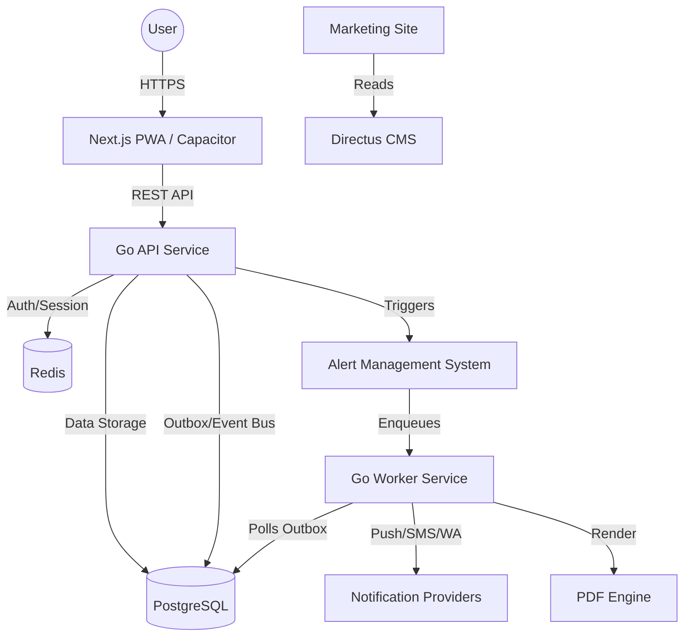

# 01 - Architecture Overview

## System Context
The School Operating System (SchoolOS) is an India-first multi-tenant SaaS. It manages the entire lifecycle of school operations, finance, academics, and safety.

## High-Level Diagram

## Component Roles

- **services/api**: Central Go REST service. Handles business logic, RBAC, policy enforcement, and audit logging.
- **services/ams**: Alert Management System. Evaluates rules (absence, fee due) and triggers worker jobs.
- **services/worker**: High-throughput Go worker. Processes async tasks: notifications, PDF generation, and webhook distribution using a DB-backed jobs/outbox table.
- **apps/web**: Next.js App Router application. Serves Admin, Teacher, and Parent shells.
- **apps/mobile**: Capacitor shell wrapping the web build for native push and deep-link capabilities.
- **infra/postgres**: Primary source of truth. Uses shared-schema multi-tenancy.
- **infra/directus**: Low-maintenance CMS for marketing, help docs, and legal content.

## Technical Decisions (Summary)
- **Language**: Go (LTS) for backend performance and concurrency.
- **Framework**: Next.js + Tailwind + shadcn/ui for frontend.
- **Database**: PostgreSQL (pgx + SQLC).
- **Communication**: REST + Webhooks.
- **Multi-tenancy**: Discriminator column (`tenant_id`) + App-layer isolation + RLS.
