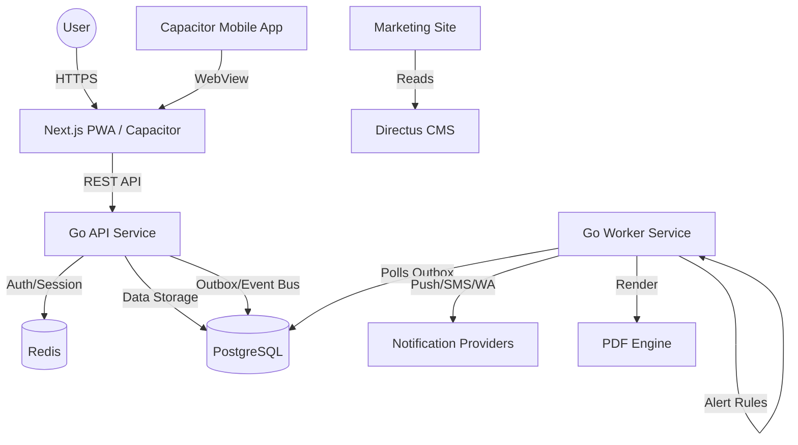

# 01 - Architecture Overview

## System Context
The School Operating System (SchoolOS) is an India-first multi-tenant SaaS. It manages the entire lifecycle of school operations, finance, academics, and safety.

## High-Level Diagram

## Component Roles

- **services/api**: Central Go REST service. Handles business logic, RBAC, policy enforcement, and audit logging. 120+ REST endpoints across 20 modules.
- **services/worker**: High-throughput Go worker. Processes async tasks: notifications (SMS/push/WhatsApp), PDF generation (receipts, payslips), webhook delivery, alert rule evaluation (absence alerts, fee reminders), and broadcast fan-out.
- **apps/web**: Next.js App Router application. Serves Admin, Teacher, Parent, and Platform Super Admin shells.
- **apps/marketing**: Next.js marketing site with SSR, feature pages, pricing, and demo booking.
- **apps/mobile**: Capacitor shell wrapping the web build for native push and deep-link capabilities.
- **packages/ui**: Shared React component library (shadcn/ui + Radix primitives).
- **infra/postgres**: Primary source of truth. 62 migrations, 3300+ lines of schema. Shared-schema multi-tenancy.
- **infra/directus**: Low-maintenance CMS for marketing, help docs, and legal content.

## Technical Decisions (Summary)
- **Language**: Go (LTS) for backend performance and concurrency.
- **Framework**: Next.js (App Router) + Tailwind + shadcn/ui for frontend.
- **Database**: PostgreSQL (pgx + SQLC). 62 migrations.
- **Communication**: REST + Webhooks + Outbox pattern.
- **Multi-tenancy**: Discriminator column (`tenant_id`) + App-layer isolation + RLS.
- **AI**: Multi-provider (OpenAI, Anthropic, Gemini) with tenant-scoped knowledge base.

## Related Documentation
- [API Reference](./api-reference.md) — Complete endpoint catalog
- [OpenAPI Spec](./openapi.yaml) — Swagger/machine-readable spec
- [Feature Tracker](../FEATURE_TRACKER.md) — Implementation status
- [UI Screen Checklist](./UI_SCREEN_CHECKLIST.md) — Pages & Storybook coverage
- [Playwright Test Map](./PLAYWRIGHT_TEST_MAP.md) — E2E regression suite
- [Session Store & Data Loading Standards](./26-session-store-and-data-loading-standards.md) — JWT/Redis session hot-path and frontend fetch rules
