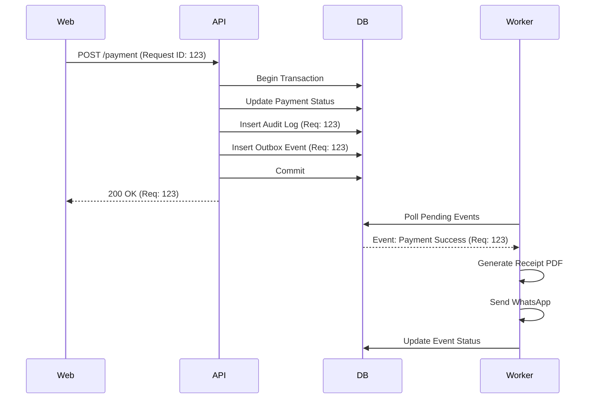

# 05 - Audit, Events, and Outbox

## 1. Immutable Audit Logs
Every sensitive state change must be logged.
- **Table**: `audit_logs`.
- **Columns**: `id`, `tenant_id`, `user_id`, `action`, `resource_type`, `resource_id`, `before`, `after`, `reason_code`, `request_id`, `ip_address`, `created_at`.
- **Constraint**: Append-only. No updates allowed.

## 2. Event Bus (Outbox Pattern)
To ensure reliable communication between the API and Worker without distributed transactions.

### Workflow:
1. **Transaction Start**: API enters DB transaction.
2. **Business Change**: Update student/fee record.
3. **Insert Outbox**: Insert event into `outbox_events` table (e.g., `payment.success`).
4. **Transaction Commit**: Both occur or neither.
5. **Worker Polling**: Worker service picks up `pending` events from `outbox_events`.
6. **Execution**: Worker sends notification/delivers webhook.
7. **Mark Done**: Worker marks the event as `processed`.

## 3. Correlation IDs
- `request_id`: Generated at the API gateway/middleware.
- Propagation: Carried into logs, audit entries, outbox events, and worker jobs.
- Result: Search for one ID to see the Entire journey from UI click to SMS delivery.

