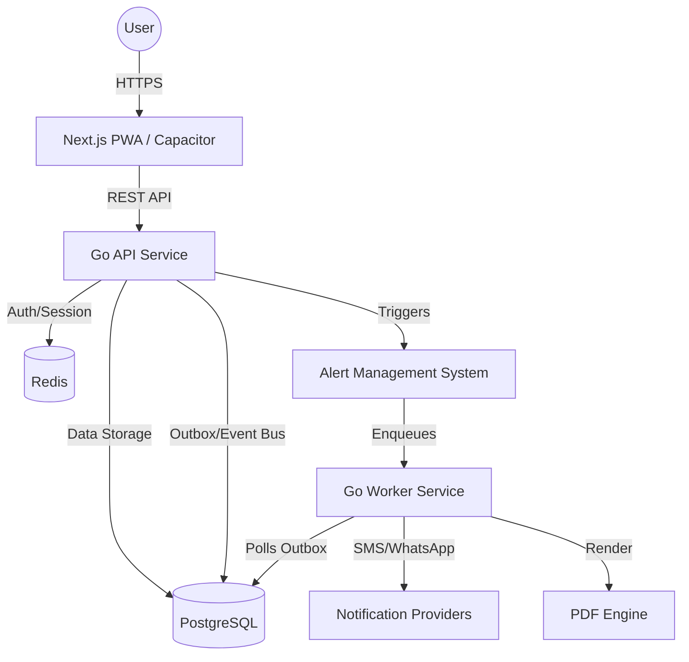

# Engineering Blueprint: School ERP SaaS Platform

This document outlines the technical architecture, design decisions, and engineering standards for the School ERP SaaS platform, based on PRD v5.0.

## 1. System Architecture

The platform follows a **Modular Monolith** architecture within a **Monorepo** structure. This provides the best balance between development velocity, type safety, and operational simplicity for an initial SaaS rollout.

### High-Level Architecture Diagram



## 2. Technical Stack Decisions

| Layer | Technology | Decision Rationale |
| :--- | :--- | :--- |
| **Monorepo** | TurboRepo + pnpm | High performance, excellent caching, and workspace isolation. |
| **Frontend** | Next.js (App Router) | SSR/ISR for performance, India-friendly SEO, and seamless PWA/Capacitor integration. |
| **Backend** | Go (LTS) | Performance, simple concurrency model (goroutines), and single-binary deployment. |
| **Database** | PostgreSQL | Robust relational support, advanced indexing, and JSONB for custom fields. |
| **Database Access**| pgx + SQLC | Type-safe Go code from plain SQL queries. Lower overhead than ORMs while maintaining type safety. |
| **Cache/Queue**| Redis | Low-latency session management and reliable task queuing. |
| **UI Library** | shadcn/ui + Tailwind | Standard-based, easily themed for white-labeling, and excellent developer experience. |

## 3. Multi-tenancy Strategy

We will use a **Shared Database / Shared Schema** approach with a **Discriminator Column** (`tenant_id`).

### Design Decisions:
1.  **Isolation:** Every table (except global master data) includes a non-nullable `tenant_id` column.
2.  **Indexing:** Composite indexes on `(tenant_id, created_at)` and `(tenant_id, primary_key)` will be mandatory for performance and isolation.
3.  **Application Layer:** A global middleware will enforce `tenant_id` scoping for every request based on the subdomain or SchoolID.
4.  **Row Level Security (RLS):** For enterprise/compliance (DPDP), we will implement PostgreSQL RLS as a secondary layer of defense.

## 4. Multi-language Strategy (India-first)

1.  **Frontend:** `next-intl` or similar for static labels.
2.  **Backend Master Data:** Entity translation tables (e.g., `Subject` -> `SubjectTranslation`) to allow regional language names for subjects, fee heads, etc.
3.  **PDF Generation:** `PDF Engine` in the worker service to render templates, ensuring full support for complex Indic scripts and rich styling.

## 5. Security & Governance

1.  **Auth:** OTP-first login via mobile for parents; Email/Password + MFA for admins.
2.  **Audit Logs:** Middleware to capture all `CUD` (Create, Update, Delete) operations in an immutable `audit_logs` table.
3.  **Policy Engine:** Logic-level checks for "locks" (e.g., fee lock after month-end) and "approvals" (e.g., marks change after publishing).

## 6. Repository Structure

```text
/
├── apps/
│   ├── web/          # Next.js Frontend
│   └── marketing/    # Next.js Marketing Site
├── services/
│   ├── api/          # Go API Service
│   └── worker/       # Go Worker Service
├── packages/
│   ├── ui/           # Shared React Components
│   └── config/       # Shared TSConfig, ESLint, Prettier
├── infra/            # Docker & Infrastructure configs
└── docs/             # Product & Engineering documentation
```

## 7. CI/CD Scaffolding

- **GitHub Actions:**
    - `pr.yml`: Build, Lint, and Type-check on every Pull Request.
    - `deploy.yml`: Staged rollout to staging/production on merge to `main`.
- **Versioning:** Semantic Versioning + Conventional Commits.
